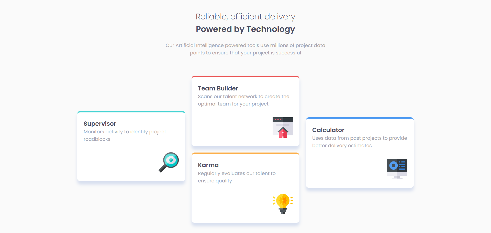
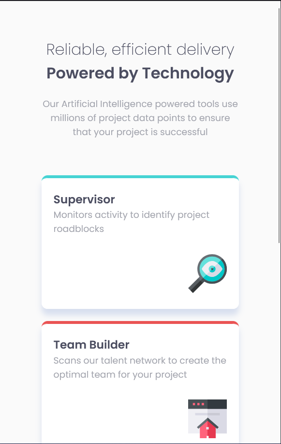

# Frontend Mentor - Four card feature section solution

This is a solution to the [Four card feature section challenge on Frontend Mentor](https://www.frontendmentor.io/challenges/four-card-feature-section-weK1eFYK). Frontend Mentor challenges help you improve your coding skills by building realistic projects. 

## Table of contents

- [Overview](#overview)
  - [The challenge](#the-challenge)
  - [Screenshot](#screenshot)
  - [Links](#links)
- [My process](#my-process)
  - [Built with](#built-with)
  - [What I learned](#what-i-learned)
  - [Continued development](#continued-development)
- [Author](#author)

## Overview

### The challenge

Users should be able to:

- View the optimal layout for the site depending on their device's screen size

### Screenshot

**Desktop**



**Mobile**



### Links

- Solution URL: [Add solution URL here](https://github.com/Marvin-Erazo/four-card-feature-section)
- Live Site URL: [Add live site URL here](https://your-live-site-url.com)

## My process

### Built with

- Semantic HTML5 markup
- CSS custom properties
- Flexbox
- CSS Grid
- Mobile-first workflow

### What I learned

CSS grid columns and 

```css
  .card-container {
    grid-template-columns: auto auto auto;
  }

 #karma {
    grid-column: 2/3;
  }
```

### Continued development

CSS grid Layouts with grid areas and responsive grid sections


## Author

- Frontend Mentor - [@Marvin-Erazo](https://www.frontendmentor.io/profile/Marvin-Erazo)
- Linkedn - [Marvin Erazo](https://www.linkedin.com/in/marvin-erazo-b971a7221/)
- Github- [Marvin-Erazo](https://github.com/Marvin-Erazo)

